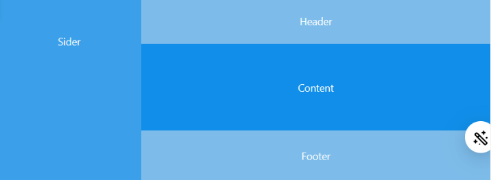
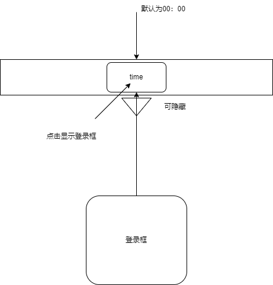
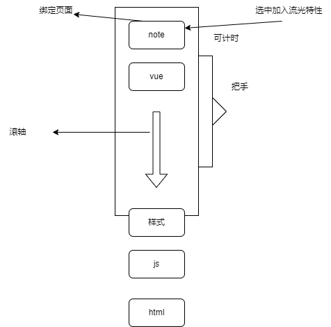
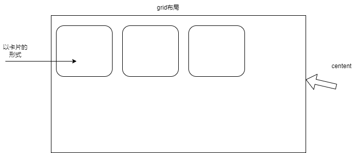
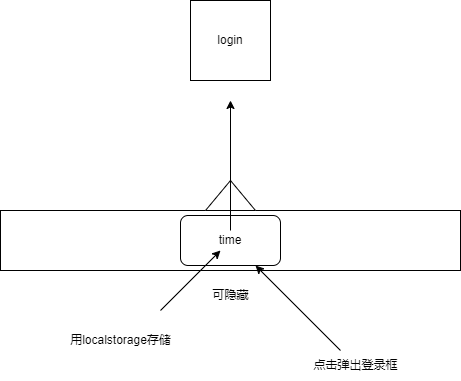

# 页面设计

## 功能

不开放注册

记录并存储页面访问时间，并作为学习时间高亮显示

完成支持md文件

balabala后期加功能

加上响应式布局

往好看的来

## 第一个页面

布局基本格式

Sider,header,footer都会在一段时间后自我隐藏。当鼠标移动到边框时可显示，content会自适应

###  header

这里的时间为总学习时间

### aside

### content

### footer

